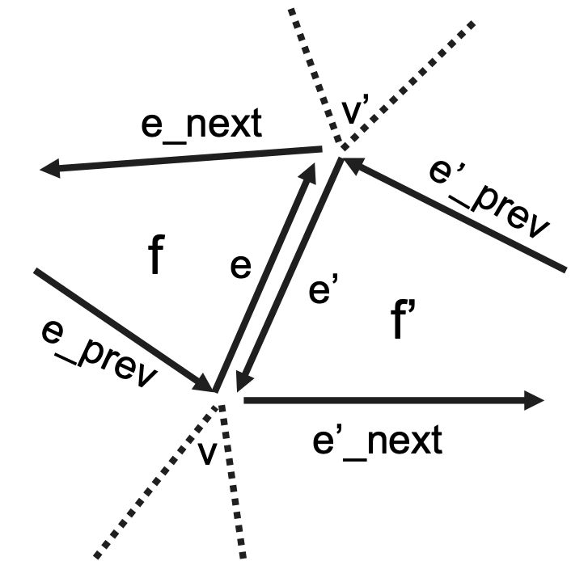
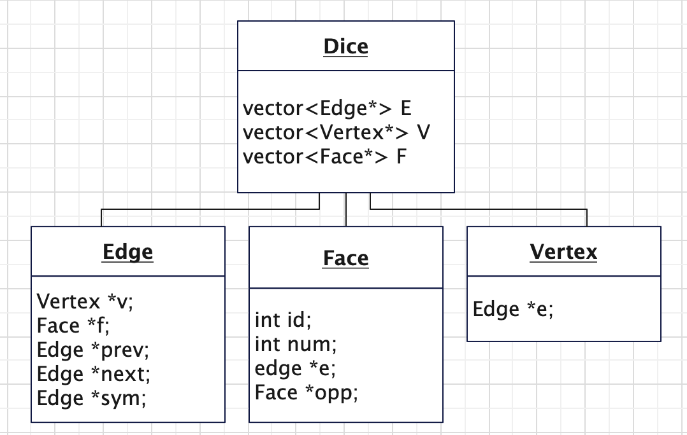
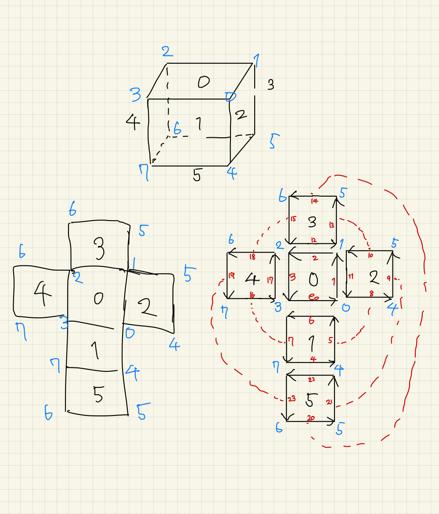
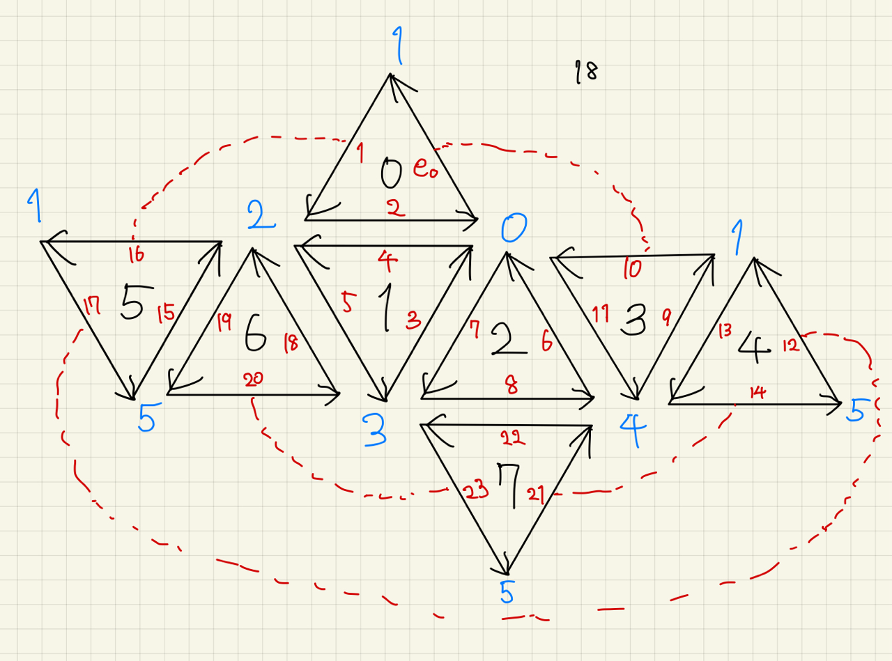

# 卒業研究プログラム
2023年度 卒業研究「凸等面多面体における数均衡ダイスの数え上げ」で作成したC++のプログラム

設定した立体について数均衡ダイスの各制約を満たす配置とその数を求めることができる。
全ての配置を総当たりでチェックする方法と、バックトラック法(反対面のみ)が実装してある。

本資料およびプログラムは、先に卒研発表の配布資料をみてから読むことを推奨する。

---

## 動作環境
solとmacOS 14.2 (Intel/Apple Silicon)で動作することを確認済み。
前提ツールはg++とmake。C++11をサポートしているバージョンを使用してください。

## コンパイル
makeが使えるなら
```
$ make
```
と実行するだけ。するとmainという実行ファイルが生成される。

## 実行方法
```
$ ./main
```
と実行すると
```
...
(略)
...
configuration: 1, 7, 2, 8, 3, 6, 4, 5, 
O: 0
V: 1
F: 0
configuration: 1, 7, 2, 8, 5, 4, 6, 3, 
O: 0
V: 1
F: 0
configuration: 1, 8, 2, 7, 4, 6, 3, 5, 
O: 0
V: 1
F: 0
configuration: 1, 8, 2, 7, 6, 4, 5, 3, 
O: 0
V: 1
F: 0
configuration: 1, 8, 3, 6, 7, 4, 5, 2, 
O: 0
V: 1
F: 0
O: 16, V: 6, F: 0, OV: 0, VF: 0, OF: 0, OVF: 0
number of configurations: 1680
```
のように出力される。(これは正八面体の場合)
最後の2行が集計結果。([注意](#配置数の出力と内部処理))
O: 反対面制約を満たす配置数, V: 均衡頂点制約を満たす配置数, F: 均衡面制約を満たす配置数, OVなどの2文字以上のところはそれぞれ制約を同時に満たしている配置数を表す。
number of configurations は調べた配置の数を表す。

その上の行には
```
configuration(配置): id0の面の数字, id2の面の数字, ..., id(n-1)の面の数字
O: 反対面制約を満たすか(満たすなら1,満たさなければ0)
V: 均衡頂点制約を満たすか
F: 均衡面制約を満たすか
```
の形式でいずれかの制約を満たす配置すべてについて表示される。
idの振り方などは[データ構造](#データ構造)を参照。

## 立体の変え方・バックトラック法の実行
main.cppのmain関数(143行目)内で、
```
    d.create_polyhedron(OCTA);
    
    brute_force(&d);
    // back_track(&d);
```
`d.create_polyhedron(OCTA)`を`d.create_polyhedron(CUBE)`のように変えると立方体について実行できる。作成済みの立体はdice.hに記述してある。
また、`brute_force(&d)`をコメントアウトして、`back_track(&d)`をコメントインするとバックトラック法(反対面制約のみ)で実行できる。バックトラック法の方は集計機能がないので、行数を数えるか自分で実装してください。


## データ構造
面や辺の隣接関係(位相構造)を扱うためにWinged-Edgeというデータ構造を使用している。(詳しくは論文や発表資料を参照)
辺に主眼をおいた表現方法であり、eはv, e_prev, e_next, sym, fへの参照を保持する。

<!--  -->

サイコロと辺、面、頂点はクラスで実装している。
クラス図は以下である。ただしメソッドは除外してある。


立体をプログラム上で登録する手続きは、dice.cpp内のcreate_polyhedron関数に書いてある。
1. init(辺数,頂点数,面数)で立体を初期化
2. 回転対称性(ただし面の中心を垂直に通る直線を軸として, k回転対象のk)を登録
3. 辺のidと関連する要素(v, e_prev, symなど)のidを紐付け
4. 反対面を登録(片方からのみで良い, id0->id6と登録すればid6->id0は自動)

とするが、3番のidの付け方は以下の方法で決める。
例として立方体で説明する。右下の図のように番号をつけることを目標とする。

まず、立体の展開図を各面ごとに分解し、
面を左回りに囲うように有向辺を描く。展開図組み立てるとつながる辺は赤い点線のように接続を描いておく。
次に、以下の手順で面のid(黒字)を決める。制約があるので気を付けること。
1. id:0番は好きな面にする
2. 立体に反対面がある場合、面数をnとしてid:n-1番は、id0の反対面にする
3. (id0の面の中心を垂直に通る軸に対して回転対称性があれば)(正多面体であれば) 軸を囲うようにid1番から残りの番号を順番につける([後述にも注意](#回転対称部分の面のid))
4. 上記の回転対称性がなければ(正多面体でなければ)残りの番号を好きにつける。

そして、有向辺のid(赤字)を0番から自由につける。(でも規則性を持たせると後で入力しやすい)
最後に頂点のid(青字)を0番から自由につける。組み立た立体上で同じ頂点は同じ番号にすることに注意！

上記によって決めたidを使って、setEdge関数で各辺に対し(辺id, 辺の始点となる頂点id, 左の面id, 向かってくる辺id, 出ていく辺id, 向きが逆の辺id)を登録する。

その他の立体の登録情報はdice.cppにハードコードしてある。(行儀が悪い)
また、idを割り振った展開図は[こちらのPDF](./img/input_data.pdf)にある。
## 各ファイルの内容
クラスごとにファイル(.cppと.h)の組を作っている。
- サイコロ: dice.(cpp, h)
- 辺: edge.(cpp, h)
- 面: face.(cpp, h)
- 頂点: vertex.(cpp, h)
- 数え上げ: main.cpp
- 一部の実行結果: results/

基本的に変数、関数の説明などは各ヘッダファイルに書かれている。


## 注意すべき点
### 回転対称部分の面のid
回転対称部分の数字の並びが同一の順番でなければいけない。例えば、正八面体だと、id0の面の中心を垂直に通る軸に対して3回転対称で、下図の(id1,id2)、つまり(逆三角, 三角)の部分が回転によって繰り返し現れる回転対称部分である。したがって、次のid:3,4は、(逆三角, 三角)に対応する順でつけなければならず、(id4,id3)の順ではいけない。
これは正多面体のときのみ注意する必要がある。(正多面体はすでに実装してあるが何か手を加えるなら)


### 反対面がない場合の反対面制約
立体に反対面が存在しない場合、命題論理の考えからすべての配置で「反対面制約を満たす」とするべきである。本プログラムもそのように設計してあるが、そのまま実行すると全ての配置が出力され他の結果が見づらいので、立体に反対面がない時のみ反対面制約のみを満たす配置のカウントを除外すると良い。
また、バックトラック法の場合だと実行時エラーになる。

### 面の数字の割り当て
凸等面多面体の対称性から、id0の面のダイスの目の数字は1に固定してある。

### 実行時間
正二十面体だと総当たり法では途方も無い。バックトラックで1,2時間程度。
結果はファイルにリダイレクトするとあとから見返せて良い。

### 配置数の出力と内部処理
プログラムの出力の各項目は「少なくともその制約は満たしている配置の数」を表示している。
一方でプログラム内部のカウントの仕方は「その制約のみを満たす配置の数」をカウントして、最後に足している。(main.cpp内print_sum関数を参照)
例えば、OVの項目の数字は、(反対面制約を満たし、均衡頂点制約を満たし、均衡面制約は満たさない)配置数と、全ての制約を満たす配置数を足して表示している。

## 変更したほうが良い点
- バックトラック法の実装(全部書き直すことを推奨。今の実装だとV,F制約を扱いづらいことがわかった)
- コマンドラインから立体等を指定できるように
- 立体の設定はハードコーディングじゃなくて他のファイル(CSVなど)に数字だけ書いて、プログラムから読み取る形式にした方がよい

## その他
不明な点があれば、作者か、ChatGPTに聞いてください。

## License
本プログラムは研究目的に限り自由に使用可。


